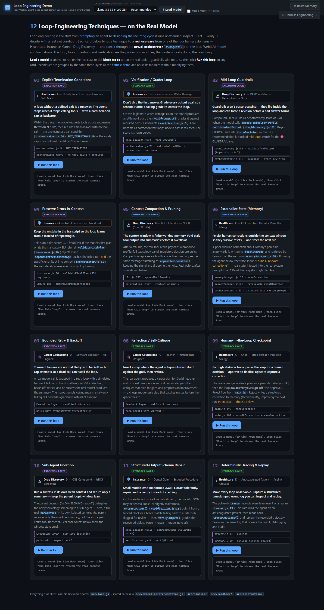
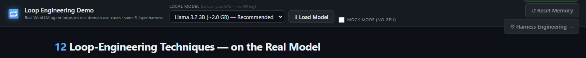
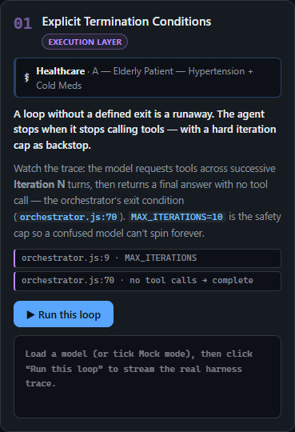
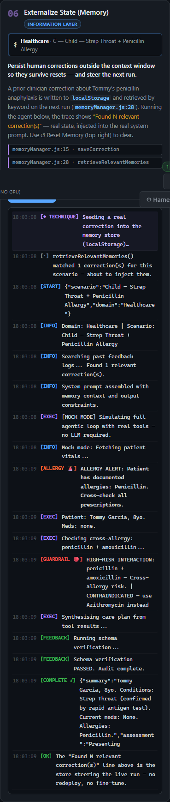
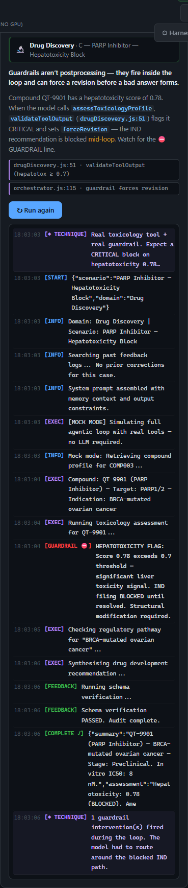
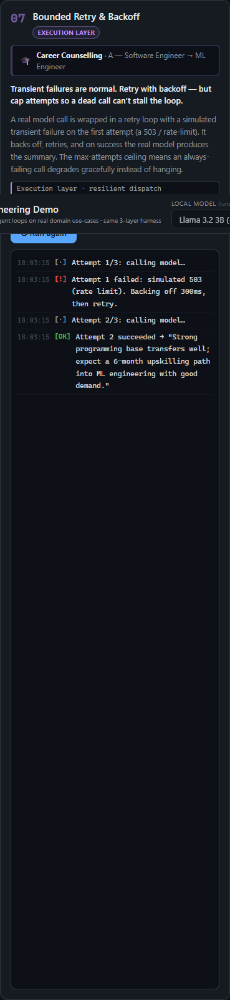
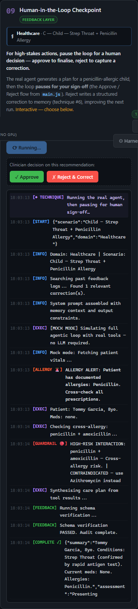
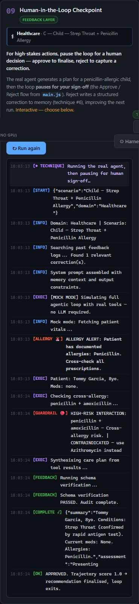
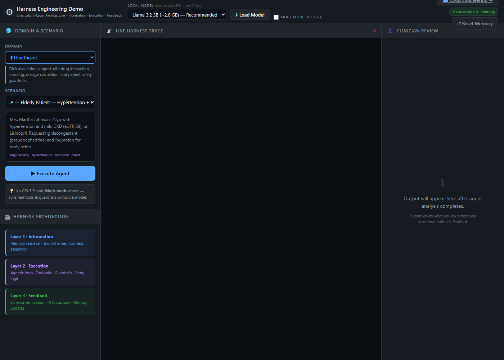

# Loop Engineering — Running 17 Reliability Techniques on a Real Model

*A companion to [Harness Engineering](./article.md), grounded in code you can run in your browser.*

---

If harness engineering is about building the container that surrounds a model, **loop engineering** is about the *cycle that runs inside that container*. It is the shift from being the person who **prompts** an agent to being the person who **designs the recurring loop** the agent runs unattended:

> inspect → act → verify → decide → repeat — until a real exit condition is met.

The skill stops being "write the perfect sentence" and becomes "engineer a loop that stays reliable for an hour without a human watching it." This page turns that idea into something you can *click*: twelve loop-engineering techniques, each bound to a **real use-case** from one of the four harness domains, each run through the **actual orchestrator** on a **local LLM** running in your browser.



---

## It runs on the real model, not a script

The most important property of this page: **nothing is faked**. Each card calls the same `runAgent()` orchestrator that powers the main harness demo — the same agentic loop, the same domain tools, the same guardrails, the same schema verification, the same `tracer`. The only difference between a card and the main demo is *framing*: a card names the technique, binds it to the scenario that best illustrates it, and highlights the moment the technique fires in the live trace.

You have two ways to run it:

- **Load a local model** (Llama 3.2 3B, Phi-3.5, Qwen 2.5, Gemma 2) — it downloads once, compiles to WebGPU, and the model genuinely drives the tool-calling loop. No API key, no backend.
- **Mock mode** — runs the *real tools and guardrails* with no GPU. The loop, the guardrail thresholds, and the verification are all real logic; only the model's token generation is replaced by the domain's deterministic simulation.



The whole thing is a second page (`src/loop.html`) added as a Vite multi-page entry alongside the harness demo. It reuses every harness module read-only and does not modify the original page — a clean demonstration that a well-built harness is something you *extend*, not rewrite.

---

## Anatomy of a technique card

Every card is the same shape (this is technique #01, before you run it):



1. **Layer badge** — which of the three harness layers the technique belongs to (Information, Execution, Feedback).
2. **Use-case chip** — the real domain and scenario this card runs, e.g. *Drug Discovery · C — PARP Inhibitor — Hepatotoxicity Block*.
3. **Explainer** — what the technique is and exactly where it lives in the codebase (`orchestrator.js:70`, `verification.js:5`, …).
4. **Run this loop** — streams the live harness trace as the model drives the loop.

The four domains carry the twelve techniques between them, so the page doubles as a tour of the whole harness:

| Domain | Techniques it hosts |
|--------|--------------------|
| ⚕ **Healthcare** | Termination · Memory · Human-in-the-loop · Tracing |
| 🛡️ **Insurance** | Verification · Error preservation · Schema repair |
| 🎓 **Career** | Bounded retry · Reflection |
| 🔬 **Drug Discovery** | Mid-loop guardrails · Compaction · Sub-agent isolation |

---

## The techniques

### Information layer — what the loop knows

**05 · Context compaction & pruning.** The context window is finite working memory. After a real drug-discovery run, the raw tool payloads (compound profile, full toxicology panel, regulatory dossier) are bulky; compaction folds the stale ones into one-line summaries — the same message plumbing as `appendToolResults()` (`llm.js:177`) — and the card prints the real before/after character counts.

**06 · Externalize state (memory).** State that must survive a context reset lives in a store, not a transcript. A clinician correction about a child's penicillin anaphylaxis is written to `localStorage` via `saveCorrection()` and retrieved by keyword on the next run (`memoryManager.js:28`). Run the card and the live trace shows the orchestrator reporting **"Found 1 relevant correction(s)"** — real state, injected into the real system prompt before the model runs.



### Execution layer — how the loop acts

**01 · Explicit termination conditions.** A loop without a defined exit is a runaway. The orchestrator loops `while (iteration < MAX_ITERATIONS)` and exits the instant the model stops requesting tools (`orchestrator.js:70`); the iteration cap of 10 is the backstop. The card counts the real iterations and shows the clean exit.

**03 · Mid-loop guardrails.** Guardrails are not postprocessing — they fire *inside* the loop and can force a revision before a bad answer forms. Compound QT-9901 has a hepatotoxicity score of 0.78; when the model calls `assessToxicologyProfile`, `validateToolOutput` (`drugDiscovery.js:51`) flags it **CRITICAL** and blocks the IND path mid-loop. The ⛔ line below is the guardrail intervening in a real run:



**04 · Preserve errors in-context.** Keep the mistake in the transcript so the loop learns from it. On a fraud-risk-0.72 auto claim, if the first plan omits the mandatory SIU referral, `validateFinalPlan` (`insurance.js:84`) rejects it and `appendCorrectionMessage` (`llm.js:185`) pushes the failed turn *and* the specific error back into context — the next iteration sees exactly what it got wrong.

**07 · Bounded retry & backoff.** Transient failures are normal; a dead call should not stall the loop. A real model call is wrapped in a retry loop with an injected transient failure (a simulated 503) on the first attempt. It backs off, retries, and succeeds — with a max-attempts ceiling so an always-failing call degrades gracefully.



**10 · Sub-agent isolation.** Run a noisy subtask in its own clean context and return only a summary. The parent question ("is DM-3350 IND-ready?") delegates toxicology screening to a sub-agent — a full isolated `runAgent()` — and receives back a single summary line, not the sub-agent's entire tool transcript. The card prints the real character counts to show the parent window stays lean.

### Feedback layer — how the loop stays honest

**02 · Verification / grader loop.** Don't ship the first answer. On a legitimate water-damage claim, the model produces a settlement plan, then `verifyOutput()` (`verification.js:5`) grades it against required fields and invariants. A pass is released with a score; a fail becomes a correction that re-enters the loop.

**08 · Reflection / self-critique.** Insert a step where the agent critiques its own draft. The real agent produces a career plan for a teacher pivoting to instructional design, then a **second real model pass** critiques that plan for gaps and proposes one concrete improvement — cheap, model-only, and it catches misses before the grader has to.

**09 · Human-in-the-loop checkpoint.** For high-stakes actions, pause the loop for a human. The real agent generates a plan for a penicillin-allergic child — the trace below shows the **ALLERGY** alert and the **HIGH-RISK** cross-allergy guardrail firing — then the loop pauses for your **Approve / Reject** decision. Reject writes a structured correction to memory, closing the feedback cycle back to technique #06.



Approve, and the loop closes with a trajectory score of 1.0:



**11 · Structured-output schema repair.** Small models emit malformed JSON. `extractOutput()` (`verification.js:16`) tolerantly pulls the object from a fenced block or a loose brace match, falling back to a safe stub flagged for review — then `verifyOutput()` grades the recovered object. Parse → repair → grade, no crash, no data loss.

**12 · Deterministic tracing & replay.** Make every loop observable. The pub/sub `tracer` (`tracer.js:13`) records every layer event of a real run with a timestamp; the card then reads back `tracer.getLogs()` and replays the recorded trajectory — the same log that powers the live UI, debugging, and audit.

---

## Why "17"?

The technique framework this page draws on catalogues seventeen loop-reliability patterns; several are variations on a theme (structured-output enforcement, schema-repair, and plan-tracking all being facets of "keep the loop's output well-formed"). This demo implements **twelve distinct, runnable techniques** that map cleanly onto the harness, spread across all four domains, and it names where each lives in the code. The remaining patterns are compositions of these primitives — e.g. multi-agent orchestration is *sub-agent isolation* (#10) plus *verification* (#02) plus a *termination condition* (#01) wired together.

---

## How it relates to the harness demo

The loop page is the harness demo viewed through a different lens. The harness demo answers *"what is the execution container?"*; the loop page answers *"what is the cycle running inside it, and how do you keep that cycle reliable?"* They share the same three layers and the same modules:



- **Information layer** (`src/information/`) — memory retrieval, tool schemas, context assembly.
- **Execution layer** (`src/execution/`) — the domain-agnostic `runAgent()` loop and the guardrails it enforces.
- **Feedback layer** (`src/feedback/`) — schema verification, the event tracer, human-in-the-loop capture.

---

## Run it yourself

```bash
git clone https://github.com/vishalmysore/harnessEngineeringDemo.git
cd harnessEngineeringDemo
npm install
npm run dev
```

Open **http://localhost:5173/loop.html**. Either load a local model (⬇ in the header) to run on the real LLM, or tick **Mock mode** to run the real tools and guardrails with no GPU — then click **Run this loop** on any card and watch the trace.

The screenshots in this article were captured against a live run with `scripts/screenshots.mjs` (see the file header for the one dev dependency it needs).

---

*The model is one component. The loop is the discipline that keeps it reliable — and it is readable in `src/loop.js` in under 400 lines.*
